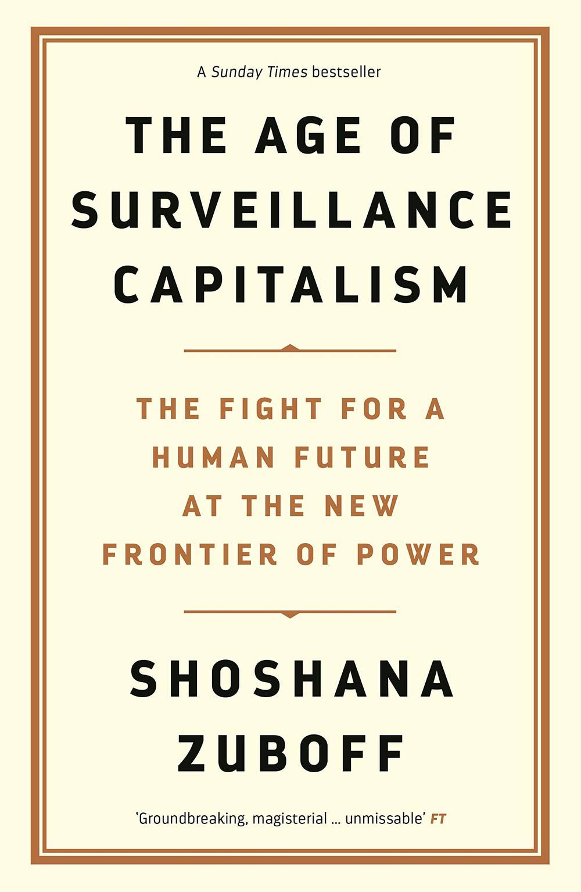
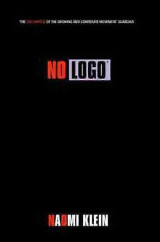

Title: My Favourite Books of 2020
Slug: 2020-favourite-books
Date: 2021-01-01 11:12

2020 was a good year for reading, what with being stuck inside for the overwhelming majority of it.

According to Goodreads I read sixty eight books in the year making up some twenty two and a half thousand pages. It's quite a lot but I've been fortunate enough to have the time for it.

I read some real standouts this year, three of which I think everyone should read. Worthy of note is the fact that all three were written by women. Historically I typically find myself reading books written primarily by men, I'm trying to do better. You probably should too.

These three are in alphabetical order, they're all worth your time, I can't rate one above any other.

## The Age of Surveillance Capitalism

This is essential reading for anyone working in the spheres of data or technology, which these days is essentially everyone. In *The Age of Surveillance Capitalism* Shoshana Zuboff argues that modern tech companies have overstepped their boundaries and are now operating as surveillance platforms with the ultimate goal of influencing our behaviour in the manner of a Skinner Box. It's written with prose that can be quite hard to read if you don't have a background reading non-stem works, but don't let that put you off.

There is some hope on the horizon, however, as we're starting to see legislators around the world waking up to this Faustian bargain we seem to have struck with tech companies in a bid to become more connected with one another.

[Full post](https://www.jacquescorbytuech.com/reading/the-age-of-surveillance-capitalism) 

## Invisible Women

We live in a world designed for men. Products are designed and build according to the *average man*. Safety standards are designed around the biology and size of the average man. The result? A world in which women find discomfort in the products they're forced to use on a daily basis. A world in which women die, simply because they were not considered when designing safety standards.

This book highlights deep injustices that permeate our society. We all need to demand better.

[Full post](https://www.jacquescorbytuech.com/reading/invisible-women)

## No Logo

I wish I'd known Parry Malm when I was in my late teens so he could have recommended this book to me then. As it stands I only got to discover this early 00's classic this year. But what a classic it is.

*Naomi Klein* holds no punches in this no-bullshit critique of capitalism and globalisation and the deep injustices perpetrated as a result of Western consumerism. Sadly, it feels like very little has changed. Maybe if more people were aware of this book that wouldn't be the case. Read it.

[Full post](https://www.jacquescorbytuech.com/reading/no-logo)

## Worthy Mentions

There were some other noteworthy titles I think folks should read. These ones won't be for everyone but I highly recommend them if they're applicable for your work or they're in a sphere that covers your interests.

### Trustworthy Online Controlled Experiments

This is *the* bible for anyone working on experimentation programs (think A/B testing and growing in sophistication from there) online. Read it, make frequent notes. Read it again.

[Full post](https://www.jacquescorbytuech.com/reading/trustworthy-online-controlled-experiments)

### Crashed

*Adam Tooze* takes you on a rich and massively detailed tour of the financial crisis and crash of '07-08, the aftershocks across Europe, Ukraine and more culminating in the austerity measures that led to the rise of populism we find ourselves in today. 

[Full post](https://www.jacquescorbytuech.com/reading/crashed)

### Range

It's often claimed that we need to specialise in a given subject to obtain success and mastery. *Range* argues the opposite. We're at our most creative and most effective when we possess a broad depth of knowledge.

[Full post](https://www.jacquescorbytuech.com/reading/range)

### Good Strategy/Bad Strategy

I started the year reading a bunch of books on strategy. Most were glorified war-porn retelling stories and anecdotes of ancient wars. Good Strategy/Bad Strategy stands above the crowd in the clarity of the message it delivers. Don't waste your time on other strategy books.

[Full post](https://www.jacquescorbytuech.com/reading/good-strategy-bad-strategy)

---

Enough about me, what were your best reads of the year?