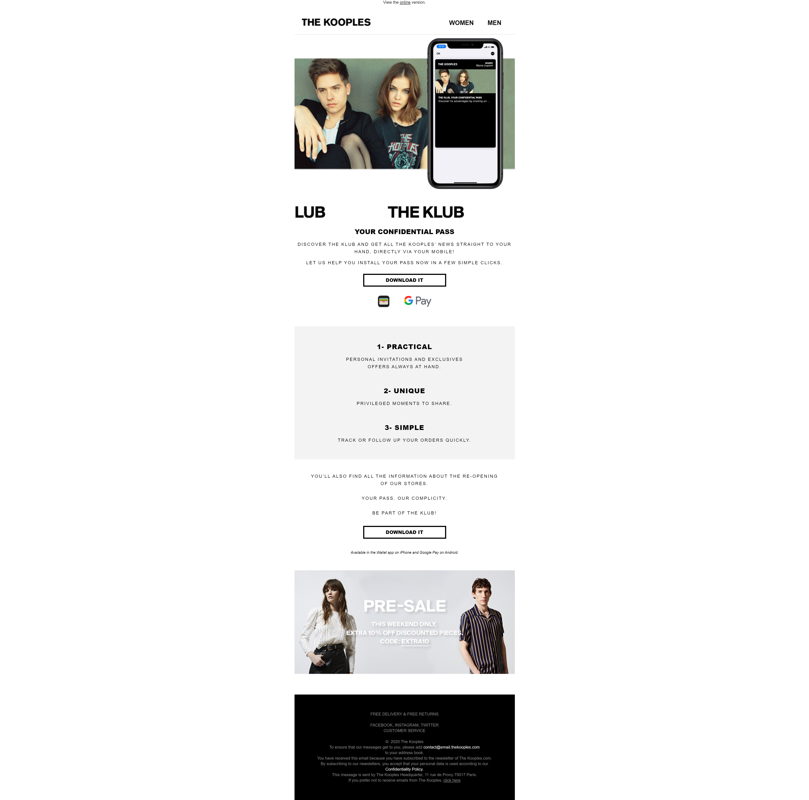
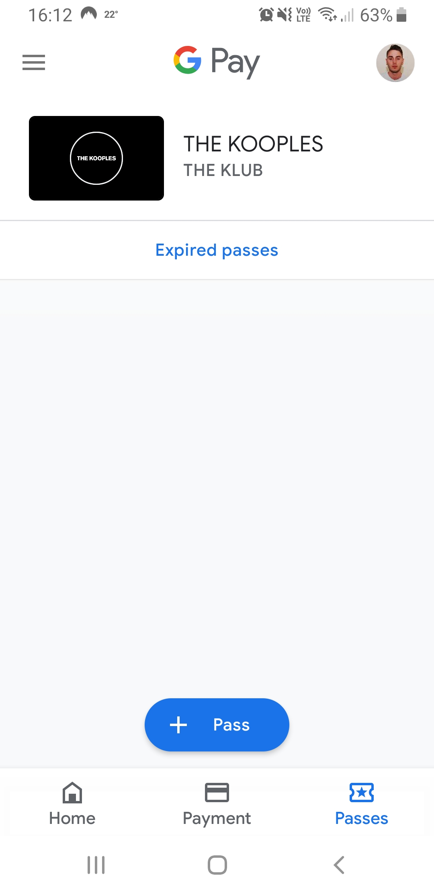
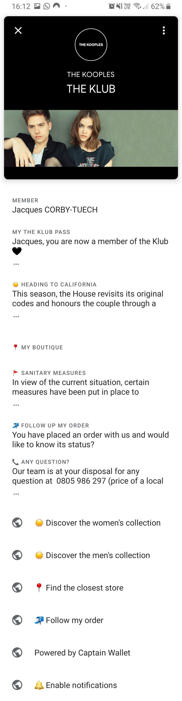

Title: Mobile Wallet Marketing
Slug: mobile-wallet-marketing
Date: 2020-06-14 17:31

You've probably seen mobile wallets before, with Google Pay on Android devices or the Apple Wallet app on iPhone, but if you're like me, you might never have thought about the marketing opportunities available within these apps.

Typically, mobile wallets are used to securely store debit and credit card details for online and contactless payments. They're also frequently used to store tickets and passes such as boarding passes for flights or tickets to an event or gig.

One aspect I hadn't come across until yesterday was the ability to store loyalty cards within your wallet.

I've been a subscriber to the Kooples mailing list for a few years now and recently received a newsletter[^subjectline] from them promoting their new Wallet based loyalty scheme, I've not seen one of these before so I had to check it out.

Once downloaded and setup, I had a new pass available in my wallet.

## Cool. Now What?

Okay, so you've successfully got some people to download your pass, now what?

This is where things become interesting to the CRM Marketer in me. Both Google and Apple allow you to customise the content of the pass, which allows you to display a variety of content or simply send a coupon or offer through to your customers. This content can be either mass market or personalised down to the individual level.

Coupons and offers can be time limited. Wallet apps can send customisable push notifications when a coupon is near expiry. Push notifications can also be geofenced, so a pass-holder can be sent a notification when they're near an associated retail location.

Coupons, offers and loyalty cards can also be updated at any time, ensuring the content stays relevant.

## How does it work?

Both Apple and Google have information on how passes work on their respective mobile OS'

* [https://developers.google.com/pay/passes](https://developers.google.com/pay/passes)
* [https://developer.apple.com/wallet/](https://developer.apple.com/wallet/)

You can also use a specialised mobile pass marketing platform like [Popwallet](https://popwallet.com/platform), [Captain Wallet](https://www.captainwallet.com/en/), [Passworks](https://passworks.io/) or [Airship](https://www.airship.com/platform/channels/mobile-wallet/).

Surprisingly, wallet support doesn't appear to have made it across to the larger enterprise marketing automation platforms yet, with no clear support in SFMC, Adobe or Responsys (although some of these can integrate with the above listed specialised platforms).

It appears that [Upland](https://uplandsoftware.com/mobile-messaging/product/features/mobile-wallet/) (Acquirer of ESP Adestra) is leading the way with a more integrated solution.

## What's Next?

This is still totally theoretical to me, I'm yet to work on a program that incorporates mobile wallets but it seems like an incredibly powerful channel for retailers with physical locations or anyone wanting to send push notifications without needing to roll their own app out.

Ever used this channel before? I'd love to know how you found it, give me a shout on Twitter or send me an email.

[^subjectline]: It had a very subtle subject line - "YOUR CONFIDENTIAL PASS".