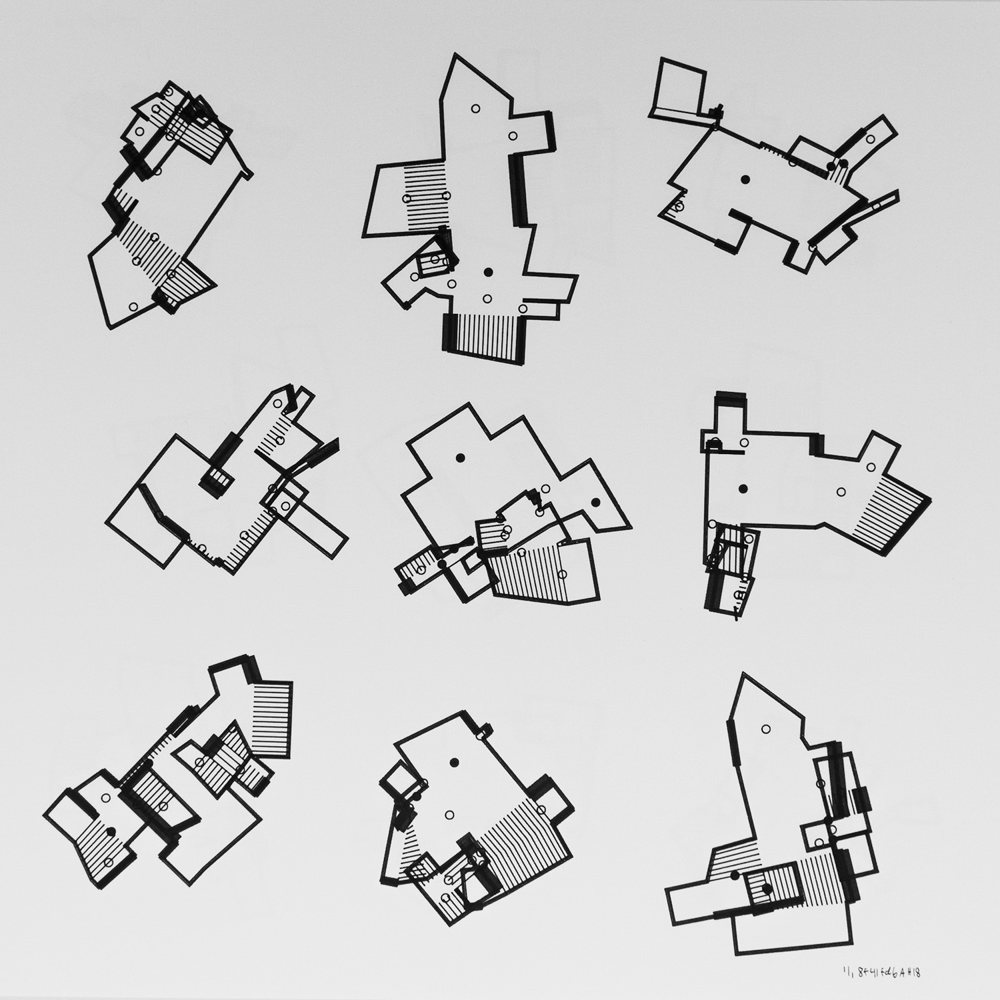
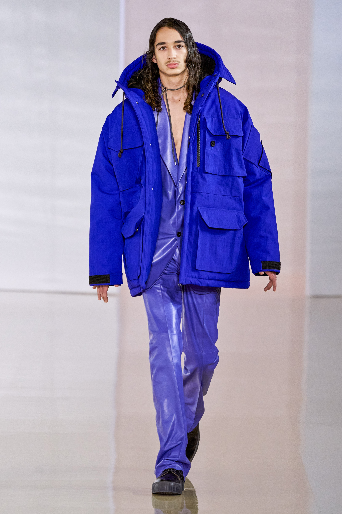

Title: NFT's Aren't the Answer to the IRL Problems of Digital Art
Slug: irl-problem-digital-art-nft
Date: 2021-03-13 13:36

Digital Art has a problem. The vast majority of digital artworks live only as digital artifacts. .jpg, .gif, .whatever files that exist only in the digital realm, taking space on a hard drive, being viewed solely through the medium of a screen.

These artworks are infinitely reproducible and therefore hard to value, if anyone can own a perfect copy of the work with the click of a button, what value does it have?

## What's an Artist to do?

This is the question many artists must ask themselves. Some choose to get around this problem by selling their work as physical media. As prints on high quality paper, tshirts, mugs, whatever. This introduces artificial scarcity to the work and by limiting access to the original digital file the artist is able to control access to the work. Of course, there's nothing stopping someone from scanning a print and selling copies of the work in turn if there's sufficiently high demand.

Some others take this further, [Anders Hoff](https://inconvergent.net/), whose work is pictured above creates generative artworks reminiscent of digital art pioneer [Manfred Mohr](https://en.wikipedia.org/wiki/Manfred_Mohr). These works are then translated into one of-a-kind physical media through an Axidraw device, which physically draws the digital work onto paper using a pen or brush.

<iframe src="https://player.vimeo.com/video/284380440?dnt=1" style="position:absolute;top:0;left:0;width:100%;height:100%;" frameborder="0" allow="autoplay; fullscreen; picture-in-picture" allowfullscreen></iframe>

Others, like Davide Quayola go further yet. Inspired by unfinished rennaisance sculptures, Quayola collaborated with [Deskriptiv](https://deskriptiv.com/captives-quayola) to produce a work called *Captives*.

> “In every block of marble I see a statue as plain as though it stood before me, shaped, and perfect in attitude and action. I have only to hew away the rough walls that imprison the lovely apparition to reveal it to the other eyes as mine see it. The best artist has that thought alone which is contained within the marble shell; the sculptor’s hand can only break the spell to free the figures slumbering in the stone. The true work of art is but a shadow of the divine perfection."
> ~ Michelangelo (1501) ~

This collaboration resulted in a digital algorithm, the outputs of which were curated by Quayola to then produce a number of 3D printed sculptures. Ultimately this work would further evolve from that point, creating a Sculpture Factory, an assembly line of unfinished physical artifacts, based on digital code.

<iframe width="560" height="315" src="https://www.youtube-nocookie.com/embed/q_Rl_ZWXrfs" frameborder="0" allow="accelerometer; autoplay; clipboard-write; encrypted-media; gyroscope; picture-in-picture" allowfullscreen></iframe>

In a similar vein, generative artist [Robbie Barrat](https://robbiebarrat.github.io/)[^1] uses his technical development skills to train AI and machine learning models, the output of which he curates in a series of works. In a recent collaboration with ACNE, Barrat created a [menswear capsule collection](https://www.vogue.com/fashion-shows/fall-2020-menswear/acne-studios) using AI to generate the clothing design.

One thing these three digital artists have in common is that they've produced physical goods to be sold as art. Whether it's "handmade" prints, unique sculptures or a piece of clothing. These are all things that can be tangibly experienced and owned.

Other artists get around this problem by selling their work as digital artifacts on specialist marketplaces such as [Sedition](https://www.seditionart.com/). Artificially limiting the number of digital copies available within the marketplace and providing a way for purchasers to view their work in a digital gallery or as a screensaver on a mobile, computer, tv, etc. Sedition features work from internationally renowned artists like Damien Hirst, who produced an exclusive throwback to his *For The Love of God* artwork by selling a .gif of a [diamond encrusted platinum baby skull](https://www.youtube.com/watch?v=5y_8DWg5W0w)[^2].

In fact, a whole category of digital picture frame products now exist to facilitate the display of digital artworks, with particular highlights including [Framed](https://frm.fm/), [Meural](https://www.netgear.com/home/digital-art-canvas/) and Samsung's [The Frame](https://www.samsung.com/uk/lifestyle-tvs/the-frame/highlights/), the latter having the benefit of also being a television.

Some other digital artworks are created as installation projects. Techniques such as projection mapping can be used to visually enhance existing 3D space or to create unique live shows such as [Amon Tobin's ISAM](https://www.youtube.com/watch?v=uh85lplBqdU). 

<iframe src="https://player.vimeo.com/video/43385747?dnt=1" style="position:absolute;top:0;left:0;width:100%;height:100%;" frameborder="0" allow="autoplay; fullscreen; picture-in-picture" allowfullscreen></iframe>

## NFT Mania

Within this landscape NFT's[^3] have emerged. First popularised by [CryptoKitties](https://www.cryptokitties.co/), a game centered around digital collectibles, with the NFT acting as proof of ownership of any given Kitty in the game. Uses of these NFT's have evolved, with recent applications allowing folks to [buy and sell Tweets](https://v.cent.co/), [sell digital artwork](https://superrare.co/), [explore a virtual world](https://decentraland.org/) and much more. 

Other applications of the technology unfortunately take a much more liberal attitude towards the concept of ownership. [Tokenized Tweets](https://tokenizedtweets.com/) allows *anyone* to lay claim to a Tweet you've posted. Alongside platforms that make no effort to prove ownership of artworks for sale, artists are waking up to find that their digital artworks are being [sold by fraudsters](https://www.theguardian.com/technology/2021/mar/12/non-fungible-tokens-revolutionising-art-world-theft) to unwitting victims.

What happens to these tokens after they have been fraudulently sold is anyone's guess. Artists will certainly struggle to obtain ownership if the new owner doesn't wish to part ways with it and the decentralised nature of the network makes it hard to track down either the fraudster or the victim.

This comes hot on the heals of what feels like mania. This week, an NFT artwork by Beeple[^4] [sold at auction](https://techcrunch.com/2021/03/11/beeples-69-million-nft-sale-marks-a-potentially-transformative-moment-for-the-art-world/) for sixty nine million dollars and everyone is desperate to get their share of the action, leading to more fraud in the system. 

Other artists are refusing to partake in the mania, citing [environmental concerns](https://joanielemercier.com/the-problem-of-cryptoart/) with the underlying technology. Transactions made through the Ethereum wallet of Beeple are responsible for 78,306 kilograms of CO2 emissions[^5] alone, equivalent to the average yearly carbon footprint of six and a half adults in the UK[^6].

Without adequate governance by marketplaces, NFT's will quickly become a poison chalice.

Fraud has always been present in the art world, but never before has it been so easy to commit fraud at this scale and with this much potential reward. Marketplaces are failing in their duty to protect artists and their clients, letting fraudsters run amok on their platforms.

Blockchains are pivoting towards a [proof of stake](https://everestpipkin.medium.com/but-the-environmental-issues-with-cryptoart-1128ef72e6a3) model instead of a proof of work model, this will drastically reduce carbon emissions but there is still no clear timeline in sight for Ethereum, the biggest blockchain for NFT's.

It's clear that artists need to find a way to sell digital artworks in a way which is rewarding both to themselves and to people looking to collect or experience these artworks, but it appears clear that as it stands, NFT's are a failed experiment.

## What Can be Done?

The answer, for artists, is not an easy one. NFT technology is promising, but it appears to be but one medium among many, and in many ways inferior to other methods of selling and buying art.

*Don't believe the hype*.

[^1]: Barrat had previously written a GAN to generate painting-like images. The code was then reused by three French students and the resulting work sold at Auction by Christie's for $432,500. Barrat was not rewarded by either party for the work he did in developing this GAN. [https://www.christies.com/features/A-collaboration-between-two-artists-one-human-one-a-machine-9332-1.aspx](https://www.christies.com/features/A-collaboration-between-two-artists-one-human-one-a-machine-9332-1.aspx)
[^2]: If you really must, you can see the work here [https://www.seditionart.com/damien-hirst/for_heavens_sake](https://www.seditionart.com/damien-hirst/for_heavens_sake)
[^3]: NFT meaning Non Fungible Token, OpenSea have a fantastic guide explaining what they are and how they work from a technical perspective [https://opensea.io/blog/guides/non-fungible-tokens/](https://opensea.io/blog/guides/non-fungible-tokens/)
[^4]: Beeple himself is creating interesting physical artifacts to go alonside the ownership of these digital assets [https://decrypt.co/50922/beeple-ethereum-nft-art-sale](https://decrypt.co/50922/beeple-ethereum-nft-art-sale)
[^5]: [https://carbon.fyi/?address=0xc6b0562605D35eE710138402B878ffe6F2E23807](https://carbon.fyi/?address=0xc6b0562605D35eE710138402B878ffe6F2E23807)
[^6]: [https://www.pawprint.eco/eco-blog/average-carbon-footprint-uk](https://www.pawprint.eco/eco-blog/average-carbon-footprint-uk)