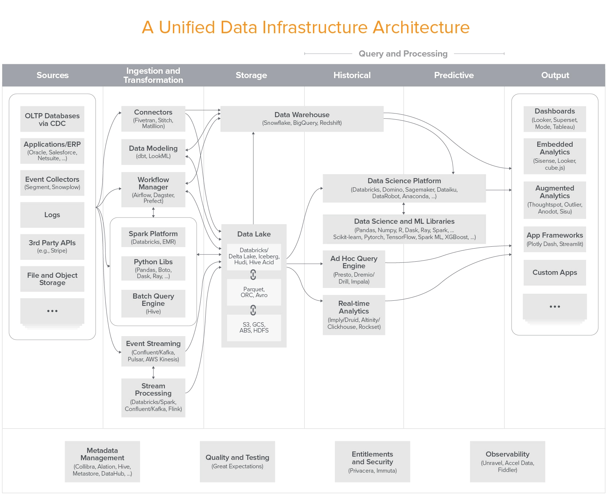
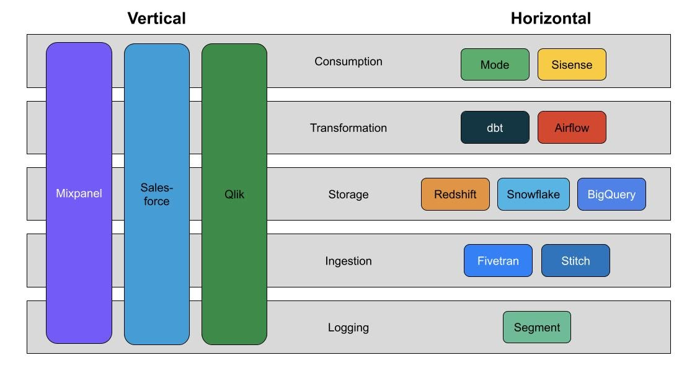

Title: Marketing and the Modern Data Stack
Slug: marketing-modern-data-stack
Date: 2022-04-07 13:08

*There is a huge transformation happening in the data space.*

I know this because, alongside my main duties running Marketing Operations at CyberSmart, I've been lucky enough to have a front-row seat in building our data capabilities and operational maturity[^mike].

The latter has led to a lot of long hours as I seek to rapidly educate myself on an industry that's changing at breakneck pace, this post is an attempt to distil what I've learnt and to hopefully help steer fellow Marketing Ops and Rev Ops folks in the right direction as they in turn seek to navigate this landscape.

As MOps we've probably experienced some of these changes first-hand. Certainly, if you're anything like me and have been in the space for a few years, you might have seen us go from siloed platforms being fed CSV's of simple data, either manually or if you were lucky, via automated SFTP, to a current state where tools are directly integrated via API's, Customer Data Platforms (CDP) or through tools such as Zapier[^acronym].

And, well, the complexity of the data we use has changed too. It's no longer good enough to batch and blast an identical campaign to tens or hundreds of thousands of people. Now you need to be able to segment your audiences and personalise your campaigns on the fly. This means platforms have either needed to adapt to support bespoke business data models of increasing complexity or businesses have had to spend long and expensive engineering hours adapting their data to bespoke platform schemas, often at the cost of utility or usability. 

Of course, this goes beyond traditional push media (email, SMS, push), you need to understand where prospects are in your buying or customer journey to more efficiently target them across platforms and devices. You need to know who's stopped using your product so you can tell a Customer Success Manager to call that customer and find out what's gone wrong.

Finally, you need to report on the effectiveness of your campaigns and your strategy. Often this means looking at data in a silo, you'll look at your email data in isolation, or your product data or advertising data. While the adoption of integrated marketing "clouds" and CDP's has gone a long way towards minimising this problem it still all-too-often rears its ugly head.

The email marketers amongst us, for example, will be familiar with the concept of list cleansing - that is, removing unengaged contacts from an email list after a period of inactivity. But if you're *only* looking at email data you're potentially missing out. Why would you remove someone from your list if they're still visiting your website, using your app or purchasing your products?

In short, you need data, lots of it and it needs to be tightly integrated across the entire customer lifecycle.

**But the landscape is changing.**

In 2020, the venture capital firm Andreessen Horowitz published an article called [Emerging Architectures for Modern Data Infrastructure](https://future.a16z.com/emerging-architectures-for-modern-data-infrastructure-2020/)[^2021] in which they outlined the explosive growth within the data infrastructure market.

> In fact, many of today’s fastest growing infrastructure startups build products to manage data. These systems enable data-driven decision making (analytic systems) and drive data-powered products, including with machine learning (operational systems). They range from the pipes that carry data, to storage solutions that house data, to SQL engines that analyze data, to dashboards that make data easy to understand – from data science and machine learning libraries, to automated data pipelines, to data catalogs, and beyond.

Image by a16z.

This proved to be a rather prophetic take and we're increasingly seeing consolidation across the data stack, with clear category leaders starting to emerge as data platforms seek to [grow horizontally](https://benn.substack.com/p/datas-horizontal-pivot) and thus become a better integrated part in a holistic system.

> Second, as companies become operationally dependent on data, vertically integrated data products create another problem: Data is segregated by tool and function. Product reporting lives in one place; sales in another; marketing in another. Like being able to go to BevMo ... and buy any beer you want, it’s nice to go to one place for all the data you need. And unlike beer at BevMo, data’s often best consumed when blended with other data 

Image by Benn.

Modern data stacks are increasingly using tools like [Fivetran](https://www.fivetran.com/), [Stitch](https://www.stitchdata.com/) or [Airbyte](https://airbyte.com/) to pull data from our marketing tools and into a consolidated data warehouse[^snowflake]. This allows a savvy MOps professional to consolidate all of their data in one place, so that they can [model it in a tool like dbt or LookML](https://benn.substack.com/p/metrics-layer) before in turn sending it on back into our marketing tools.

In practice, we've recently seen the rise of Reverse ETL tools to fill that gap - these tools exist to help businesses get data out of the data warehouse and into the tools that make use of it, with [Census](https://www.getcensus.com/) and [HighTouch](https://hightouch.io/) leading the way in growth and investment.

What does that investment look like? $60 million for Census[^census] and $40 million for Hightouch[^hightouch], but other parts of the data stack are raising even more eye watering amounts of money with dbt[^dbt] and Airbyte[^airbyte] both being recent winners. Clearly, there's a change in the air and VC's are lining up to find the eventual winner.

## But what does this actually mean?

[As predicted by Martin Casado](https://www.youtube.com/watch?v=q1nERFM9brA&t=3458s), we're starting to see this change beginning to take form within the world of MarTech.

> I think we're going to remake all the SaaS apps as data apps, right, I think Segment for CDP was just one example, I think Panther's doing a great job at SIEM and I think we're going to go through all of them. Workday, Salesforce, Adobe they're just going to be reimplemented as apps on top of the data layer.

[MessageGears](https://messagegears.com/), [Vero](https://www.getvero.com/) and [Supergrain](https://www.supergrain.com/) are leading the way here[^stack], with all three clearly positioning themselves as warehouse integrated apps. It's inevitable that we'll soon see this change with a new breed of best in class MarTech apps following the horizontal unbundling seen above with specialised tools offering segmentation[^segmentation], orchestration, [construction](https://www.taxiforemail.com/) and broadcast to send campaigns directly to consumer devices or clients.

Some, like [Phrasee](https://phrasee.co/), are well positioned to make the most of this change, others, the bundled marketing clouds of this world, will inevitably suffer as their customers move to nimbler offerings.

This change is only beginning to take shape, the pebble has only started to roll down the mountain but it's inevitable that we'll soon see unbundling across the entire MarTech landscape.

This can only be a good thing. Marketers will soon be freed from the concerns of data and technology that currently plague their days, allowing them to focus on the actual job that marketers should always have been doing, delivering the best marketing campaigns they can.

This also opens up the doors for significantly improved regulatory compliance and security across the entire marketing function. GDPR is here to stay and other countries are following suit in ensuring individuals are protected by robust data and privacy laws. It is much easier to maintain control of a tightly knit stack instead of the siloed data we see today and we'll see far fewer cybersecurity incidents like the recent hacks of [MailChimp](https://techcrunch.com/2022/04/04/mailchimp-internal-tool-breach/), [ActiveCampaign](https://bitcoinmagazine.com/technical/if-you-kyc-you-should-cya) and [HubSpot](https://www.techradar.com/news/hubspot-hacked-putting-major-crypto-firms-at-risk).

I'm excited to see where and how this changes the way marketers fundamentally operate, I hope others are as well.

## Further reading

If this is something you're interested in, I highly recommend the following

Newsletters

* https://benn.substack.com/
* https://sarahsnewsletter.substack.com/
* https://substack.com/profile/64081583-david-jayatillake
* https://arpitc.substack.com/

Podcasts

* https://roundup.getdbt.com/

Blogs

* https://airbyte.com/blog
* https://blog.getcensus.com/
* https://hightouch.io/blog/

[^mike]: I'd also like to shoutout Mike Seville, CDO at Paymentsense/Dojo who really helped me on the path towards thinking more hoslitically about the role of data in the work I do.
[^acronym]: There's probably an acronym, I just don't know it.
[^2021]: Now updated for 2021 https://future.a16z.com/emerging-architectures-modern-data-infrastructure/
[^snowflake]: The Cloud warehouse Snowflake saw their shares double at their IPO in late 2020 https://edition.cnn.com/2020/09/16/investing/snowflake-ipo/index.html
[^census]: Census recently raised $60 million for their series B funding round https://blog.getcensus.com/series-b-the-future-of-operational-analytics/
[^hightouch]: Hightouch recently raised $40 million for their series B funding round https://hightouch.io/blog/series-b/
[^dbt]: dbt recently raised $222 million for their series D funding round https://blog.getdbt.com/next-layer-of-the-modern-data-stack/
[^airbyte]: Airbytre recently raised $150 million for their series B funding round https://airbyte.com/blog/a-150m-series-b-to-power-the-movement-of-data
[^stack]: If you know of any more, please let me know!
[^segmentation]: Both [Census](https://blog.getcensus.com/census-segments-build-audiences-without-sql/) and [Hightouch](https://hightouch.io/audiences/) now offer visual audience builders as part of their rETL offering, allowing marketers to build complex segments without needing to know SQL. 