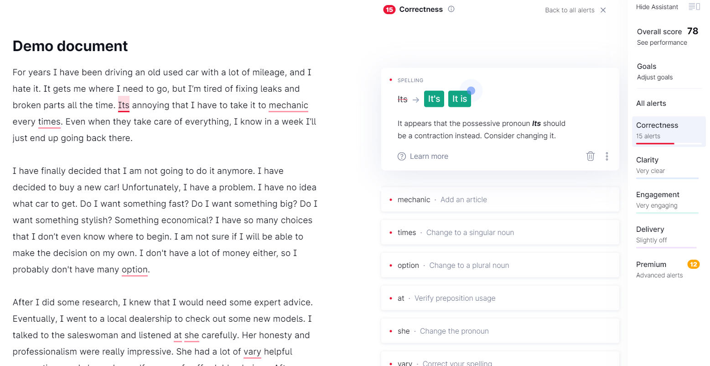

Title: Microsoft Editor, an Alternative to Grammarly's Keylogger?
Slug: microsoft-editor-grammarly-keylogger
Date: 2020-05-03 16:51

I'm not going to lie, Grammarly's product is a fantastic one. The ability to check your writing for correctness, clarity, engagement, and delivery is incredibly powerful and can help anyone become a better writer. Whether you just need a simple spellchecker or something more complex like providing common synonyms for words you're overusing.

I wish I could use it, and not solely because I'm an email geek and Grammarly send super engaging [activity report emails](https://reallygoodemails.com/emails/your-weekly-progress-report-2/).

## The Ugly

Unfortunately, there's a dark side to Grammarly's product - anything you type while using their browser extension gets logged and saved to their servers.

According to their [Privacy Policy](https://www.grammarly.com/privacy-policy#what-information-does-grammarly-collect-about-me), Grammarly collects

> User Content. This consists of all text, documents, or other content or information uploaded, entered, or otherwise transmitted by you in connection with your use of the Services and/or Software.

*But Jacques*, I hear you ask. Grammarly say [they're not a keylogger](https://support.grammarly.com/hc/en-us/articles/360003816032-Is-Grammarly-a-keylogger-)! I mean sure, by their carefully defined definition they're not, but then they're changing the meaning of the word keylogger to suit their marketing purposes.

**Don't believe me?** Here's how the word "keylogger" is defined in the [Oxford Learner's Dictionary](https://www.oxfordlearnersdictionaries.com/definition/english/keylogger).

> ​a computer program that records all the keys that a user hits so that it is possible to discover secret information such as code words

Not convinced? Here's the definition [according to Merriam-Webster](https://www.merriam-webster.com/dictionary/keylogger).

> a piece of software that records the signals sent from a keyboard to a computer usually for the purpose of gaining information about the user without the user's knowledge

Still unconvinced? Here's what dictionary.com [have to say on the subject](https://www.dictionary.com/browse/keylogger).

> a software program or hardware device that records all keystrokes on a computer keyboard, used either overtly as a surveillance tool or covertly as spyware.

It wouldn't be so bad if you were just using it to spellcheck your documents, but let's face it, we all use the web for a lot more than that.

### But who cares?

Here's a common scenario, while working from home I'm constantly checking and replying to my emails, Grammarly's ace here, highlighting any typos or mistakes I might make. But that's also where things start going wrong, by typing in someone's email address Grammarly have now automatically collected it and stored it on their servers - without that individual's consent. *Sounds like a big ol' GDPR breach to me.*

Skip forward a couple hours, I'm logging into a service I've not used for a while and can't remember my password, it's long and complicated so I click the toggle to make the password visible. Behind the scenes that toggle has changed the form from ``<input type="password">`` to ``<input type="text">`` and with that change, Grammarly can now freely access and store anything I type in that field. **Ruh-roh**.

## Microsoft Editor

***So that brings us to Microsoft Editor.***

[Introduced on March 30th](https://techcommunity.microsoft.com/t5/microsoft-365-blog/introducing-microsoft-editor-bring-out-your-best-writer-wherever/ba-p/1247931#), **Microsoft Editor** brings many of those great features you've already experienced in Grammarly.

### What about their Privacy Policy?

Microsoft's Privacy Policy is a *fucking mess* full of gobbledygook legalese. No, seriously, you try make heads or tails of [this thing](https://privacy.microsoft.com/en-us/privacystatement).

The closest reference I can find to how Editor falls under their policy is the following.

> Microsoft collects data from you, through our interactions with you and through our products. You provide some of this data directly, and we get some of it by collecting data about your interactions, use, and experiences with our products. The data we collect depends on the context of your interactions with Microsoft and the choices you make, including your privacy settings and the products and features you use.

*Yeah, that's pretty damn vague...*

In a move that inspires *some* confidence, their browser plugin provides a straightforward way to opt out of data collection. Like Grammarly, you can also disable the plugin on specific websites.

## Is Microsoft Editor a suitable alternative for Grammarly?

The long and short of it right now is *I don't know*.

Their privacy policy is undecipherable and while the product does inspire some degree of confidence with the clear ability to opt-out of data collection it's unclear precisely what you're opting out of and whether that opt-out also prevents the storing of sensitive data on Microsoft's servers.

What is clear is that Grammarly *is* a keylogger and shouldn't be used without extreme care in a browser environment.

In the short term I'm going to be giving Microsoft Editor a go, while ensuring any sensitive sites are blocked through the available settings.

More to follow, I guess.