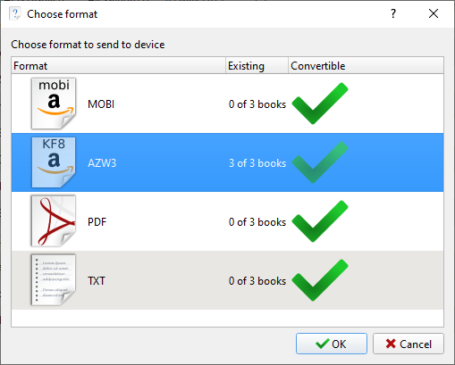
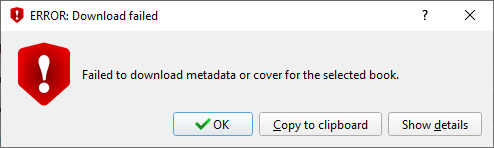
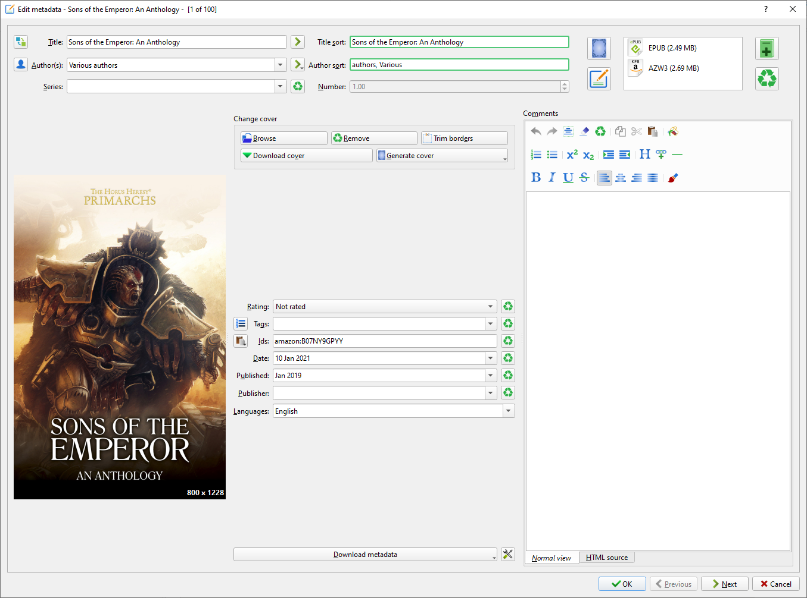
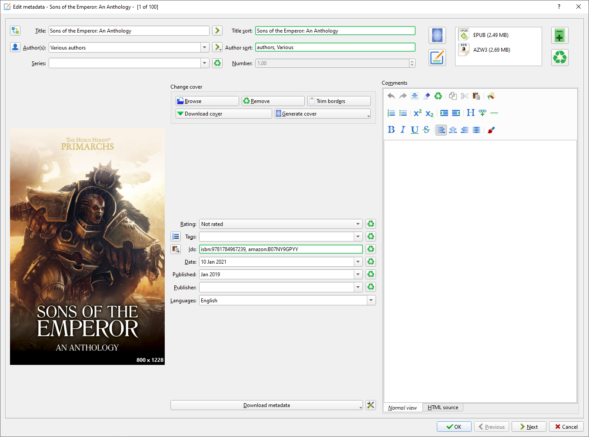

Title: Sideloading Books on Kindle with Goodreads Integration
Slug: sideloading-books-kindle-goodreads-integration
Date: 2021-01-10 13:38

I buy a lot of ebooks from Games Workshop's independent publishing arm, [Black Library](https://www.blacklibrary.com/) and frequently find myself needing to load these ebooks onto my kindle. This can be quite a pain in the arse at times, particularly if you want the integration with Goodreads to work.

Thanks to a super helpful [post on Reddit](https://www.reddit.com/r/kindle/comments/3v8du1/sideloaded_books_cant_integrate_with_goodreads_on/cxltoja/), I found a useful method you can use to easily sideload books while also making sure they integrate properly with Goodreads.

For the sake of posterity here's the process you need to follow, with images.

## What You'll Need

You'll need a few things before we get started.

1. The ebook you want to transfer over to your device, in .epub format
2. A kindle, connected to your PC via USB
3. [Calibre](https://calibre-ebook.com/) installed on the same PC

The first thing you'll want to do is launch Calibre and install a plugin called Quality Check. You can do this by navigating to `Preferences -> Get plug-ins to enhance Calibre` and searching for "Quality Check" in the User Plug-ins window. Follow the instructions to install the plugin then restart Calibre.

[Quality Check](https://www.mobileread.com/forums/showthread.php?t=125428) will allow you to easily find and update metadata for your installed books, such as finding Amazon ASIN numbers and Goodreads ID's.

## How to do it

Once you're setup and ready to go, the process is quite simple.

First, you'll want to add your books to Calibre. You can do this by dragging the files in or by clicking `Add books` in the navigation.

Now your books have been added you'll see that they're missing lots of metadata. In the screenshot above I've just added Scions of the Emperor, Dawn of Fire and Sons of the Emperor.

Next, select the book(s) you want to convert and click `Convert books`. Make sure "Output format" is set to **AZW3**. You can do this individually or in bulk.

Converting the books should take a few seconds per book but may take a while if you're converting a large library.

Now select the newly converted books and click `Edit metadata -> Download metadata and covers`. Follow the instructions from there.

At this stage you may get an error informing you that metadata or covers failed to download, we'll have to fix this manually. Instructions for this can be found [at the bottom of this article](#if-an-error-occurs).

Once the books are converted, make sure they're still selected and click `Quality Check -> Fix -> Fix ASIN for Kindle Fire` in the navigation.

Almost there! All that's left is to select your books and send them to you Kindle. Ensure this is plugged in and set to USB Drive Mode, then select the book(s) you want to transfer and in the main navigation click `Send to device -> Send specific format to -> Main memory`. Select the AZW3 files and hit OK.

The books should now be sent to your Kindle device.

You can now disconnect your Kindle and check the files are there. After you open a book, you should now also be able to use the Goodreads functionality built into the Goodreads device.

Enjoy your new book!

---

## If an Error Occurs

If an error occurs when attempting to download metadata it's not the end of the world.

What you'll need to do is manually enter the ASIN, you can find this on the product page and in the URL of the product on an Amazon page.

Copy this ID, return to Calibre, select your book again and click `Edit metadata -> Edit metadata individually`. In the Ids form field, type "amazon:" followed by the ASIN. In my case this will look like `amazon:B08CY23588`.

Hit OK and try again to download metadata.

If this fails again, you will need to also add the ISBN. This can be found on [ISBN Search](https://isbnsearch.org/). Edit the metadata again and add the ISBN-13 for your book to the Id's field.

Hit OK again and then try again to download metadata. This should now work. If it does, continue with the original instructions.