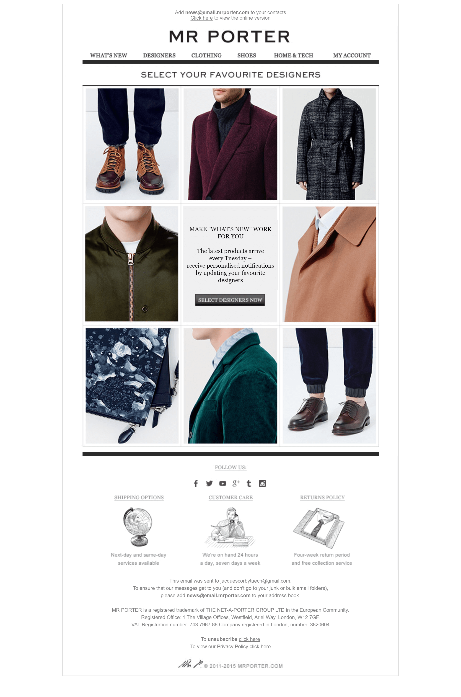

Title: How to Build a Welcome Program
Slug: how-to-build-welcome-program
Date: 2020-05-10 13:57

Some collected thoughts on welcome programs.

## What is a welcome program?

Also known as a welcome journey, or an onboarding program, a welcome program is a series of one or more automated messages (typically emails) sent to an individual when they subscribe to your mailing list.

These emails are sent to welcome a prospect, subscriber, or customer into your email program, and can be used to drive sales, introduce a customer to advanced product functionality, solve problems before they surface and more.

Messages can be generic, or they can be personalised to the individual based on a huge wealth of factors such as the signup method, acquisition channel, demographic data, purchase data, etc.

You might have heard that welcome emails typically outperform standard marketing emails, and that's true[^experian]. There are many reasons for this, and while it's easy to get lost in the weeds and overthink it, the biggest factor is that subscribers are at their most engaged when they first join your list.

While I'm going to be primarily focusing on email, it's worth remembering that there are plenty of other channels that can be used in your welcome program, from landing pages to push notifications to phone calls and more. The sky's the limit.

## What the hell do I know?

That's a great question to ask, I've been working in email and CRM marketing for the last 9 years and have run email and CRM programs across B2C and B2B. I've done everything from selling spare parts for home appliances, luxury womenswear, payment terminals, art and much more.

In my career I've worked on email programs with small audiences, in the low thousands all the way up to programs where we were sending North of two million emails on a daily basis.

So, over the years I've picked up a few tricks that I'm going to be sharing with you.

## Creating your welcome program

So, you've reached the first critical stage of your welcome program, you've identified that you need one.

At this point it's worth considering what this program is all about, **what are you trying to achieve?**

### Identifying your objective

A welcome program without an objective or goal is a waste of yours and your subscriber's time, so it's critical at this stage to think about what you're setting out to achieve.

Some goals I've come across before are:

* I want to sell more widgets
* I want to introduce someone to the features of a product they've just bought
* I want to answer questions new subscribers have before they surface and cause a problem

You might have something specific to your industry or to an individual product or service you're trying to sell, what's important here is outlining a clear achievable goal that your program will be working towards.

According to Mailchimp [^Mailchimp]

> On average, sending a series of welcome emails yields an average of 51% more revenue than a single welcome email.

### Acquiring subscribers

Before you go any further, you should consider how you're planning on gaining new subscribers.

While subscriber growth is outside the scope of this article, some common tactics you might use are to use a [lead magnet](https://www.activecampaign.com/blog/lead-magnet-ideas-and-examples) to incentivise signups or including an opt-in within your normal sales funnel.

Below you can see an example of an incentivised email subscription on [Sigma Sports](https://www.sigmasports.com/).

*At this stage I also wanted to show you the welcome email that came from that subscription box, but more than 24 hours later and I've still not received it.* 🤦‍♂️

If you're using a lead magnet, don't forget to actually deliver on the promise you've made, there's no quicker way to erode subscriber's trust than signing up for a promised discount only to never receive it.

You may also need to think about the potential complexity of your program if it has multiple entry points, such as signing up online, face to face in a retail scenario or signing up at a trade show or event. The new subscribers may have different expectations based on how they've come to join your list.

Stuck for ideas for growing your subscriber list? [Moneylab has the answers you need](https://www.moneylab.co/email/).

### Identify opportunities

Once you've identified the goal and how you're going to get new subscribers for your welcome program, you can move onto the next stage which is understanding the potential opportunities available to you to achieve that goal.

If your goal is to sell more product, you might try to answer these questions your new subscribers are likely to have.

* How does this widget work?
* What differentiates WidgetCo from WidgetLTD?
* What does WidgetCo stand for?

With those questions above identified, you could easily create a 3-part program to help you answer those questions and sell more widgets.

If you're struggling to find appropriate questions, or aren't sure that you're asking the right questions you absolutely should be talking to people within your business, particularly anyone in sales or customer service who may be able to offer invaluable insights into how the customer or prospect is feeling. Not only does this improve the performance of the program as a whole but it helps to build internal support for your welcome program. Sounds like a win/win to me.

At my most recent workplace, we noticed that there was a high level of customer dissatisfaction from customers in their first month of being with us. After speaking with the customer service team we realised our billing cycle was unclear to customers and they were shocked when they received their first bill. By sending an email about billing in our welcome program, clearly explaining how it works, we were able to produce an immediate uplift in our first month NPS scores[^NPS]. More notably we were also able to reduce costs by decreasing the number of calls to our customer service team.

You might also see an opportunity to learn more about the subscriber in question. Mr Porter do this exceptionally well with an email in their welcome program designed to learn more about your favourite brands.

You could also use this opportunity to learn the customer's size, style preferences and more. This information can prove to be invaluable later when your customer shifts from your welcome program to your traditional marketing program.

If you're feeling adventurous you can also use the opportunity to build an immediate rapport with your new subscriber by inviting them to reply if they have any questions about your product or reply. It's a fantastic way to break through stale automated messaging and bring a real personal touch.

### Teasing out the key messaging

So you've expressed your goal and identified the opportunities, now it's time for the nuts and bolts of your welcome program, copy.

Your first email is always going to be the most important one, make sure to use the opportunity to thank the new subscriber for signing up and use the opportunity to set the right expectations about your welcome program and your overall email marketing program.

Don't forget to fulfil the promise you made with any potential lead magnet (discount codes, downloads, etc)!

For any subsequent emails (or SMS, push, DM, whatever) you might be putting together for the program, make sure to keep a degree of consistency across your messaging, from a clear design language to a consistent tone of voice.

Your emails don't need to be copy intensive, video content not only tends to have a high click rate[^eSpares] but lends itself particularly well to certain types of communication. Use these emails as an opportunity to experiment with your content.

Image taken from Really Good Emails.[^Platforma]

If you're struggling with the tone of voice you should use in your copy the image below showcases copywriter Eugene Schwartz' Five Levels of Awareness model. Eugene Schwartz was a legendary direct mail copywriter and the author of multiple books, including the highly regarded Breakthrough Advertising[^breakthrough].

Image taken from Search Engine Land[^sel].  

Don't forget to check details like the sender name and sender email address are clear and obvious. If I signed up for emails from WidgetsCo I expect to get an email from WidgetsCo, not Employee Bob. If you're expecting or hoping for replies, don't send from a noreply@ address, which is bad practice in any case[^noreply].

This is also the opportunity to use any personalisation available to you. Whether that's a simple first name personalisation through to more complex examples like including products based on observed or inferred behaviour or even creating different messages entirely for segments of your program. Personalisation and [segmentation is often considered a bit of a panacea](https://www.jacquescorbytuech.com/writing/why-segmentation-isnt-always-the-answer.html) when it comes to the email community but it can certainly be highly effective when done appropriately.

At this stage you might just have one email, or you might have a series of 20 highly segmented messages to send over multiple touchpoints, that's fine. Your brand is going to have its own requirements.

### Going live

Well, there's no time like the present. Time to hit the big red button and get this program live!

***What's the worst that could happen?***

## Ongoing improvements

**You didn't think you were done, did you?**

Now your program's live, the real work begins. It's time to look at the data and work out whether your new program is soaring high or plummeting down to the asphalt.

If you followed this process you should have a clear goal that you can measure your performance against. Does the data indicate you're achieving your goal? if not, it might be time to reconsider your approach or change some of your messaging.

One business[^growthlab] found that shifting a key sales message from the third email in their welcome program to the immediate landing page someone sees when they signed up boosted their revenue by 89%. Don't be afraid to make radical changes to your program if you think it'll make an impact.

Don't forget to continue to ask for feedback from other stakeholders in your business. Clearing up one issue identified by your customer service team might have exposed another, allowing you to further refine the program to solve that new problem.

The more you can test on an ongoing basis the better your program is going to be. *Perfection is nice, but I'm yet to meet a marketer that hits a home run on the first swing.*

## Key components

I guess you could call this the tl;dr of this post, but to summarise, this is the process I think you should follow when setting out to create a welcome program.

1. Identify the objective for your program
2. Work out how people are going to enter your program
3. Break down your overarching objective into chunkable opportunities
4. Speak to stakeholders in the business, they'll know pain points your customers/prospects encounter
5. Build out your program, focus on clear messaging that hits those opportunities
6. Get it live!
7. Test, test and test again

## Final considerations

While this post is ostensibly about building a welcome program, it can apply to any automated program you're looking to build out. The process remains the same, even if the goal changes.

It's important to balance your business interests against the interests of the subscriber. While you might want to aggressively push for a sale right from the get-go it's unlikely that a new subscriber will appreciate that interest. This could damage the email channel in the long-term with poor engagement rates across the board.

One thing you might want to do is ensure that while a subscriber is in your welcome program they don't receive your regular marketing emails - this helps to ensure that they don't get confused or feel inundated by too many mixed messages.

If you have the opportunity to experiment with channels other than email, do so! Email is amazing and powerful, but you can experiment with many more channels. Don't just limit yourself for no reason.

This is just the approach I've found to work for me and brands I've worked for over the years, but I'd love to hear whether you think there's something missing, or if you've found another approach to work better for you. Let me know via email or Twitter at the links below.

[^experian]: [Experian welcome email report](https://www.experian.com/assets/marketing-services/white-papers/welcome-email-report.pdf)
[^Mailchimp]: [How a Lifestyle Brand Makes Lasting Connections with Welcome Emails](https://mailchimp.com/resources/make-lasting-connections-with-welcome-emails/)
[^NPS]: NPS being a way to measure customer loyalty - [Wikipedia article](https://en.wikipedia.org/wiki/Net_Promoter)
[^eSpares]: I have no data to hand, but my first job was working for [eSpares](https://www.espares.co.uk/), a spare parts retailer. Emails containing video content consistently outperformed other email types.
[^Platforma]: [Platforma email on Really Good Emails](https://reallygoodemails.com/emails/how-to-use-platforma-in-figma/).
[^breakthrough]: [Breakthrough Advertising on Goodreads](https://www.goodreads.com/book/show/8662312-breakthrough-advertising).
[^sel]: [Five ways to flip your copywriting for higher conversion rates](https://searchengineland.com/five-ways-to-flip-your-copywriting-for-higher-conversion-rates-157078).
[^noreply]: [No reply email addresses are a plague](https://www.vice.com/en_us/article/vbbp5x/no-reply-email-addresses-are-a-plague).
[^growthlab]: [How I moved my pitch earlier and increased revenue 89%](https://growthlab.com/how-i-moved-my-pitch-earlier-and-increased-revenue-89/)
