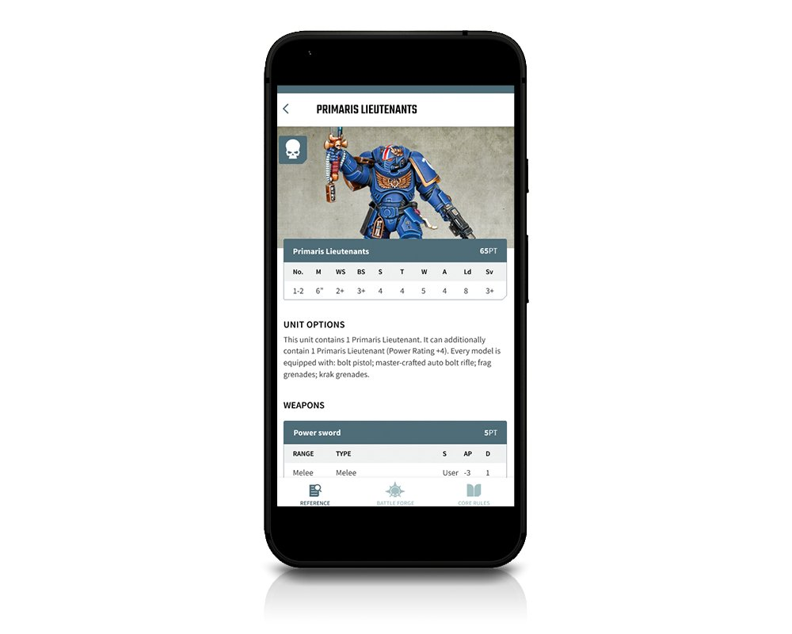
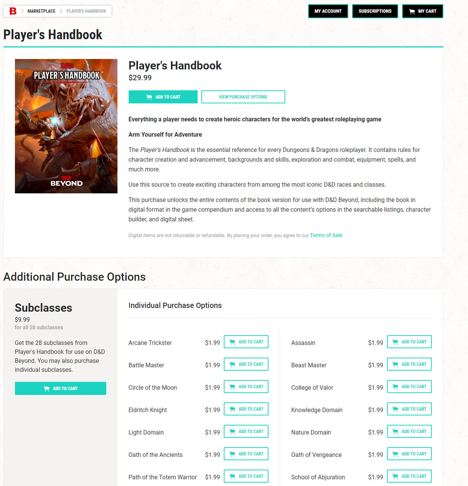

To coincide with the launch of Warhammer 40k 9th edition, Games Workshop [recently announced](https://www.warhammer-community.com/2020/07/09/the-app-all-you-need-to-know/) the release of their first dedicated app for the 40k franchise.

This app will finally allow 40k players to easily check core game rules and rules for any additional supplements or codexes they purchase. A modest £3.99 monthly subscription will also allow app users to have access to an army list builder and enhanced referencing, the latter of which seems to imply some sort of enhanced search but isn't clear.

The digitisation of codexes has been a long time coming, allowing app users to easily navigate rules that are always up to date. Previously, a gamer would have to have a physical copy of the book, plus various rules errata and FAQ's acquired online which are designed to clarify and amend rules to aid ongoing balancing.

[](../../images/post-images/warhammerApp.png)

The army list builder in particular seems to be a smart move and a sign of Games Workshop's ongoing strategic initiatives, _more on that later_.

From a cost perspective, £3.99 is modest, however Games Workshop are directly competing here with fan-built [BattleScribe](https://battlescribe.net/) and [Wahapedia](http://wahapedia.ru/). I'm not an advocate for piracy however the reality is Games Workshop have lagged in this area and it's  unsurprising that, with their [pricing](https://www.games-workshop.com/en-GB/Codex-Space-Marines-HB-EN-2019) [strategy](https://www.games-workshop.com/en-GB/Codex-Salamanders-EN-2019), they're having to directly compete with pirate products. People don't want to pay £25+ just to understand how to play the game.

This app has been a long time coming, and it's a total no-brainer following the huge success of [D&D Beyond](https://www.dndbeyond.com/) (DDB) built by the awesome folks at Curse (I worked there pre-DDB days). From a cost perspective DDB subscriptions are a little more attractive, however folks have long complained that purchases of physical books don't allow them to get access to the relevant books and features in DDB with having to additionally purchase the digital content too.


## Warhammer Digital Strategy

There are obvious shortcomings from this being an app based product. Since 2016 Games Workshop have made huge headway in the way they interact with their community through the [Warhammer Community](https://www.warhammer-community.com/) site, with a large focus and investment in written and video content. Unlike DDB however this community aspect is currently relatively limited, there are no forums offered or ways for players to share their love of the hobby directly with other players.

According to the most recent[^halfyear] half-year report:

> Communities and customer engagement - we have continued to build new communities, opening 12 stores in the period and c.200 trade accounts. Our digital engagement continues to increase in reach and scope. Users accessing Warhammercommunity.com over the six month period are up 48% compared to the same period last year and sessions per user have also increased, meaning our fans are visiting more often and are more engaged with the content

48% YoY user growth for an already well established website is hugely impressive, as is the increase in sessions per user, though I think that can be attributed more to an increase in posts rather than an increase in engagement on the site.

The missing piece of the puzzle for Warhammer Community is exploiting user generated content, there are [huge](https://www.reddit.com/r/Warhammer40k/) [thriving](https://www.dakkadakka.com/) [communities](http://www.bolterandchainsword.com/) of passionate fans sharing everything from gaming tips to painting guides to photos of [incredible miniatures](http://www.coolminiornot.com/topweek).

Furthermore, a significant portion of Games Workshop's community outreach work is done through third party social media websites, which represents significant risks. An owned platform would eliminate these risks.

Given the strong social aspect of the game and the fact that Games Workshop have 517 stores in 23 countries around the world (plus an additional ~4,700 independent retailers), there's also a strong argument to be made for a need to more localise the digital experience at the community level, in a way that can be used to build player engagement with their local store. Retail represents 34%[^annualreport] of sales so is a critical path to building engagement and sales.

A digital experience would allow store managers to easily organise and plan games and events for their local community, while giving the community and prospective buyers an easy way to join the hobby at their own pace. 

It's easy to forget, but retail stores should not be judged solely on the revenue they bring in directly. By being on the high street, Warhammer stores attract new players to the hobby and provide key avenues in creating great customer experiences - bridging that digital gap would provide a combined digital storefront and community so that customers can experience the great retail environment in the comfort of their own home.

Snuck into the announcement is a mention of a **My Warhammer** account. While mentioning no details at all, the move towards creating a single sign-on across all Warhammer experiences would be a tremendous boost in better understanding customer behaviour.


## Warhammer Digital Opportunities

In late October last year, Games Workshop migrated their marketing emails from Mailchimp to Selligent. That might not sound like a big deal to the average 40k fan, but I've been in marketing long enough to understand what a platform like Selligent can bring to a retail business when properly integrated.

While I've not yet noticed any significant personalisation when it comes to their email program, there are hints available that Games Workshop may soon take this channel seriously.

A quick look at their website shows that they're starting to integrate Selligent tracking on their main retail store and their more specialised [Forge World](https://www.forgeworld.co.uk/en-GB/FW-Home) store.

```html
<script>
    var trackdata = trackdata || [];
                    
    (function (d, s, id) {
        var js, sjs = d.getElementsByTagName(s)[0];
    if (d.getElementById(id)) return;
        js = d.createElement(s); js.id = id;
        js.src = "//games-workshop.slgnt.eu/optiext/webtracker.dll";
        sjs.parentNode.insertBefore(js, sjs);
    }(document, 'script', 'webtracker'));
</script>
```

Selligent will also allow them to use push and in-app messaging and more importantly for a business like Games Workshop, will allow them to use location based messaging based on an app users proximity to a retail store.

From a CRM program perspective, Games Workshop will not only know exactly what content and products a customer has looked at and purchased online and in-store, but by using prior purchase history they'll be able to personalise product recommendations based on army lists created by an app user.

To maximise this latter opportunity, Games Workshop should make the list builder part of the free content available in the app and should roll out a web app to maximise the number of gamers providing valuable personalisation data.

The Games Workshop online store should become a highly personalised system that would reduce marketing and merchandising costs while delivering a higher ROI.

It should be a no-brainer that Games Workshop make direct purchasing of additional rules possible within their app. With the data they'll be capturing not only will they be able to sell digital content directly, but with campaign books they'll be able to directly sell rules as microtransactions. For example a Death Guard player may simply want to purchase the new rules for DG units available from the [War of the Spider](https://www.games-workshop.com/en-GB/Psychic-Awakening-War-Of-The-Spider-EN-2020) supplement without shelling out for the whole book.

[](../../images/post-images/ddbMicrotransactions.png)

_Microtransactions on DDB_.

Providing support for a [digital wallet](https://www.jacquescorbytuech.com/writing/mobile-wallet-marketing) would not only allow Games Workshop to collect information about purchases through digital loyalty cards, but the scheme could be rolled out to all 4,700 independent retailers. This would allow Games Workshop to know not only what an individual has purchased directly from them, but also from their trade network which represents 47% of all sales.

Finally, Warhammer Community needs to be directly integrated into the online shopping experience. Gamers should be able to directly purchase products from news pages.

[^halfyear]: [page 3 of the half year report](https://investor.games-workshop.com/wp-content/uploads/2020/01/2019-20-half-year-report.pdf)
[^annualreport]: [Page 5 of the 2018-2019 annual report](https://investor.games-workshop.com/wp-content/uploads/2019/07/2018-19-Annual-Report-with-Cover.pdf)