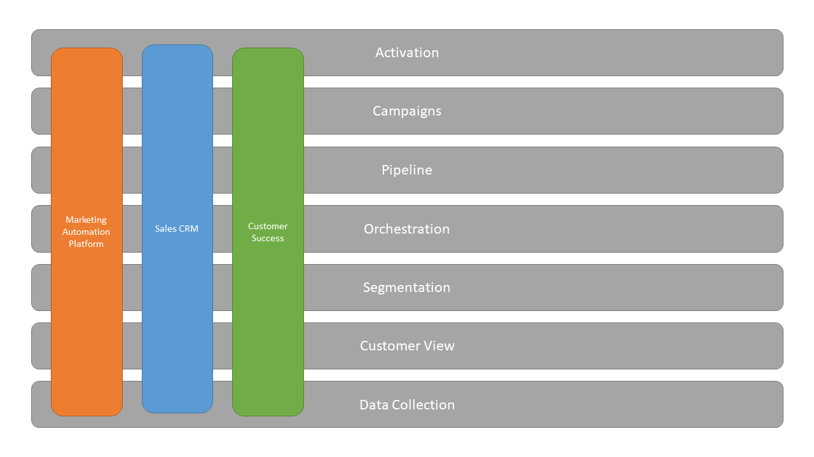

There's a lot of crossover in the capabilities tools customer facing teams use to communicate with customers.

Marketing have *Email Service Providers* (ESP) and *Marketing Automation* platforms (MAP). Sales have *Customer Relationship Management* (CRM) and *Sales Engagement* platforms. Customer Service and Success have Customer Engagement platforms and Customer Success platforms. That's a lot of tooling and unfortunately, there's a huge amount of crossover between what these tools can do.

I'll get into why that's a problem in a minute.

## The Current State of Play

If you think holistically about what these platforms can do, it tends to break down into the following layers.

1. Data Collection
2. Customer View
3. Segmentation
4. Orchestration
5. Pipeline
6. Campaigns
7. Activation

Let's look at these a little more closely.

### Data Collection

A lot of these platforms have mechanisms in place that allow them to collect data, either through some sort of form mechanism, such as an email signup form from an ESP or a Lead form for a CRM. A number of these also have bespoke tracking scripts, for example a javascript tracking library allowing you to see what pages a given customer or contact has visited on your website.

These tools also collect first party events, such as email events (opens, clicks, bounces, etc), customer interactions (ie with a live chat) or hundreds of other types of data that are either collected or generated from the platforms themselves.

This data often sits within the individual platform it was collected in and frequently is not shared back to other tools or systems.

### Customer View

All of these platforms allow you to see your customers in one way or another. In many cases this is an incredibly limited view at the person level, however many of the better platforms will allow you to associate people with other Objects, such as business entities or products.

Each platform will typically have it's own data model, which the customer view will be forced to conform to. For example, your Salesforce CRM may have a rich understanding of people, businesses and products and the relationships between these but your Mailchimp ESP will only have allow you to model people.

These differing views creates confusion across teams and departments as there is no single way to understand who your customers are, what products they may have purchased in the past or how businesses relate to one another.

### Segmentation

When you've got a view of your customers, one thing you'll frequently want to do is segment them. That is, filter them based on various traits to find groups of customers that fit certain criteria. It could be customers who've purchased > 1 time, or customers called Bob, or businesses in South East England.

If you've got a data point on the customer, you can filter it. But there's the problem. If your customer view is different between platforms, you might not be able to build the same segments.

The other challenge is those segments exist as distinct entities within the different platforms. You might update your "VIP Customer" group in your CRM but forget to make the same updates to your segments in your marketing and CS tools.

### Orchestration

Journeys, Flows, Playbooks, whatever your tool calls these, they're all basically the same thing. When a thing happens, do something else.

You might use this to automate an email to customers identified as being at risk of lapsing, or onboarding new customers, or even automatically updating records in your CRM.

Having multiple places doing orchestration causes all sorts of problems. Different teams can't see who's being sent what or why, leading to duplicate journeys being created and customers receiving a disjointed experience, changes in one place aren't pushed back to other platforms and journeys can't be connected, such that completion of one journey might trigger another to start.

This can get particularly messy when teams operate entirely in silos and there's no one in place providing any oversight between which tool should be used for what.

### Pipeline

Pipeline will be familiar to any sales person but can also be found in various marketing and customer success tools. Effectively 

### Campaigns

### Activation

This is the business end of things. Activation [^activation]

In general terms we're dealing with a hodgepodge of integration between tools, with no real single source of truth.

Reporting is missing - reporting belongs in the data stack.

## What Might the Future Look Like?

Flexible data model.

RevOps doesn't need to be about silos.#

[^activation]: Not to be confused with certain rETL vendors calling themselves "activation" tools - those can more accurately be described as data *transport* tools.