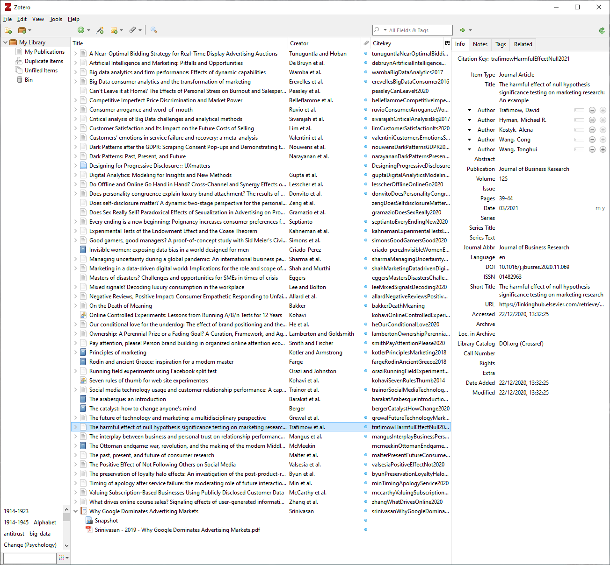

In an excellent post by Steph Smith, titled [Writing is Thinking: Learning to Write with Confidence](https://blog.stephsmith.io/learning-to-write-with-confidence/), she describes what she calls the Thinking and Writing Cycle as follows:

> Writing and thinking are two peas in a powerful pod. Critical thinking leads to good writing, which leads to clearer thinking, and so on. By improving your writing, you are also improving your ability to think and vice versa.

Earlier this year [I started using a note taking app](https://www.jacquescorbytuech.com/writing/zettlr-notes-zettlekasten.html) called [Zettlr](https://www.zettlr.com/) to write notes for all manner of things. I use it to take down notes for projects I'm working on, software I'm using, books I'm reading, articles I've read online and lots more. I also, as you can guess, have started using it to improve what I suppose can be called my capacity for critical thinking. It's been great.

Going hand-in-hand with writing is reading, and just like Zettlr, I've found a great open source tool that I use to keep track of what I've read[^1], when. That tool is [Zotero](https://www.zotero.org/).

Zotero lets you build a personal library of books, articles, web pages, PDF's and more with just a few clicks, and can be synced with an online account for access across multiple devices (including of any PDF you might have chosen to upload).

You can use [DOI links](https://en.wikipedia.org/wiki/Digital_object_identifier) to import an article into your library with tons of useful metadata such as access dates, authors, etc.

There's also a useful Chrome browser extension that lets you easily bookmark web pages for future referencing.

There are a whole host of features for academic writing, but those are less useful for me. If you do need to keep track of a bibliography for referencing purposes though Zotero is perfect, and [works incredibly well with Zettlr](https://docs.zettlr.com/en/academic/citations/).

With many of us needing to continue to work from home, and with employers adapting to environments in which large numbers of staff may well continue to work from home, high quality asynchronous communication becomes the de-facto gold standard.

We all need to spend time improving the quality of our non-verbal communication. In that scenario, taking up a writing habit can only be a good thing, and building a personal research library has to be encouraged to provoke the Thinking and Writing Cycle.

If you're a marketer like me, I would highly recommend spending some time getting comfortable with an RSS reader like Feedly and subscribing [to](https://statmodeling.stat.columbia.edu/) [great](https://cxl.com/blog) [websites](https://wordtothewise.com/blog). I also highly recommend keeping tabs on the following journals.

* [Journal of Marketing Research](https://journals.sagepub.com/loi/mrja?ai=2b4&mi=ehikzz&af=R)
* [Journal of Interactive Marketing](https://www.sciencedirect.com/journal/journal-of-interactive-marketing)
* [International Journal of Research in Marketing](https://www.sciencedirect.com/journal/international-journal-of-research-in-marketing)
* [Journal of the Academy of Marketing Science](https://www.springer.com/journal/11747)
* [Quantitative Marketing and Economics](https://www.springer.com/journal/11129)

Building a reading habit is one of the best things to do, for your career and for your own personal development. 

Read more. Document what you write. Write about it.

[^1]: Specifically referring to websites and academic articles here. While you can keep tabs of books you've read in Zotero I primarily use [Goodreads](https://www.goodreads.com/user/show/86396018-jacques-corby-tuech) for that.